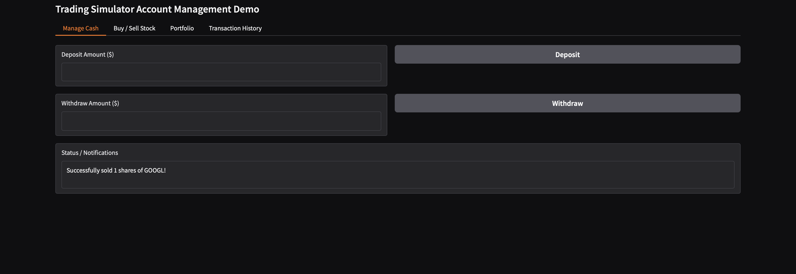
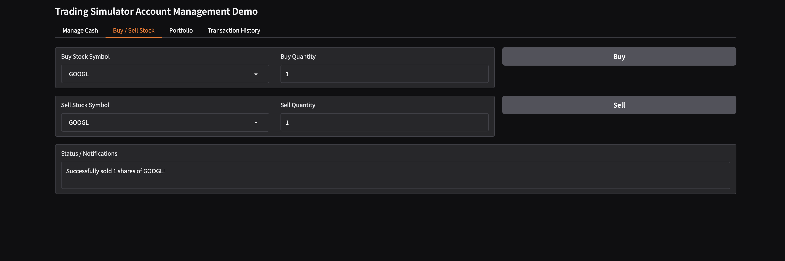
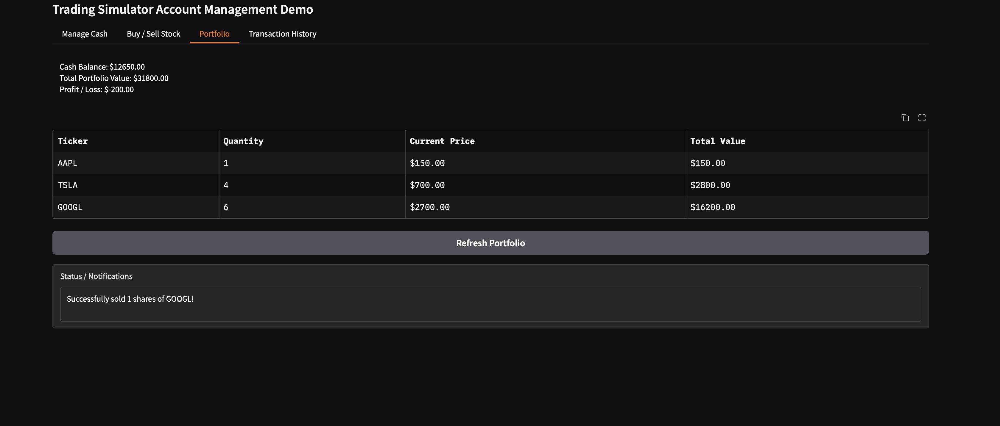
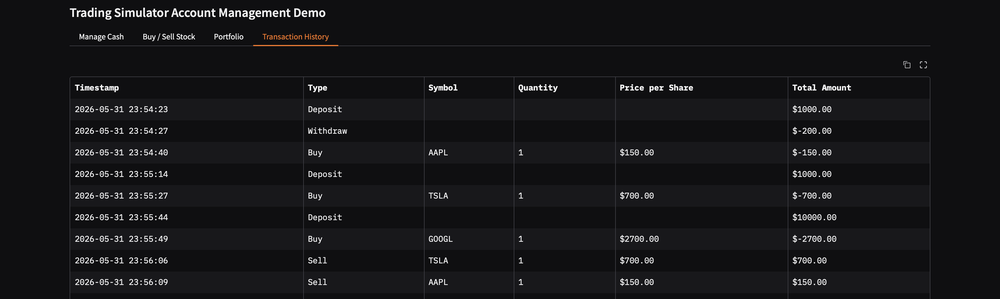

# Multi-Agent Stock Trader
This project is a multi-agent orchestration pipeline built with CrewAI that models a complete software development lifecycle (SDLC). The system automatically designs, writes, audits, tests, and containerizes a secure stock trading simulation platform based on high-level requirements.
## Key Features
* **Closed-Loop QA Verification:** Automatically executes generated unit test suites via subprocesses and feeds back execution errors to developer agents for self-healing.
* **Frontend Smoke-Testing:** Probes Gradio UI execution with a startup timeout checkpoint to catch import issues and binding NameErrors.
* **AppSec Vulnerability Auditing:** Utilizes a SecOps agent to audit code for logic vulnerabilities and financial boundary flaws before packaging.
* **Automated Containerization:** Dynamically generates a production-ready Dockerfile and verified requirements.txt dependency file.
## Agent Descriptions
* **Tech Lead (Engineering Lead):** Analyzes product requirements and designs structured OOP class definitions, exceptions, and typed method signatures.
* **Developer (Backend Engineer):** Implements raw PEP 8-compliant Python modules using strict input checks and custom exceptions.
* **Auditor (Security Engineer):** Audits code modules for boundary overflows, logical security flaws, and transaction bypasses.
* **Tester (Test Engineer):** Writes complete mock-asserted unit tests targeting standard paths and extreme error boundaries.
* **Prototyper (Frontend Engineer):** Builds reactive Gradio interface prototypes with validation notifications and error handling.
* **Release Engineer (DevOps):** Generates dependency manifests and multi-stage execution Dockerfiles for clean production runs.
## Architecture and Workflow
The pipeline runs sequentially to build and test the codebase:
1. **Design Stage:** Tech Lead designs the architecture document.
2. **Development Stage:** Developer implements the module code.
3. **AppSec Audit Stage:** Auditor reviews backend security and logic.
4. **QA Stage:** Tester drafts the mock unit tests.
5. **Frontend Stage:** Prototyper builds the UI layout.
6. **DevOps Stage:** Release Engineer configures deployment assets.
### Closed-Loop Verification
Unlike static code generation pipelines, this factory implements two runtime verification loops:
* **Backend Self-Healing Loop:** The orchestration engine runs the generated unit test suite as a python subprocess. If the tests fail, the traceback is captured and routed back to the developer agent to correct the source file. This loop repeats up to three times or until all tests pass.
* **Frontend Smoke-Test Loop:** The system executes the Gradio interface in a subprocess with a timeout threshold. If the UI crashes on startup due to syntax or variable binding issues, the error log is sent to the frontend engineer for auto-remediation.
---
## Application Screenshots
To display screenshots of the generated platform on GitHub, create a folder named `screenshots/` in the project root and add your images using the designated file names:
* **Deposit and Withdrawal UI Panel:**
  
* **Stock Purchase and Sale Interface:**
  
* **Portfolio Summary and Holdings Table:**
  
* **Complete Transaction Audit Logs:**
  
---
## Installation
Ensure Python >= 3.10 and < 3.14 is installed on your system. This project uses UV for dependency management.
1. Install UV dependency manager:
   ```bash
   pip install uv
   ```
2. Install project dependencies:
   ```bash
   crewai install
   ```
3. Configure your API keys in the `.env` file:
   ```env
   OPENAI_API_KEY=your_openai_api_key
   GEMINI_API_KEY=your_gemini_api_key
   ```
---
## Running the Project
### 1. Execute the Agentic Factory
To compile the architecture and execute the generation and verification loops:
```bash
crewai run
```
*Note: This command runs the pipeline defined in `src/engineering_team/main.py`.*
### 2. Run the Generated Platform
Once the pipeline successfully passes all automated tests, the final output will be written to the `output/` directory. Run the Gradio interface locally:
```bash
python output/app.py
```
---
## System Configuration
* **Agent Prompts:** Customize agent profiles, objectives, and roles in `src/engineering_team/config/agents.yaml`.
* **Task Definitions:** Configure input contexts, constraints, and output file parameters in `src/engineering_team/config/tasks.yaml`.
* **System Requirements:** Adjust the target application requirements inside the `requirements` variable in `src/engineering_team/main.py`.